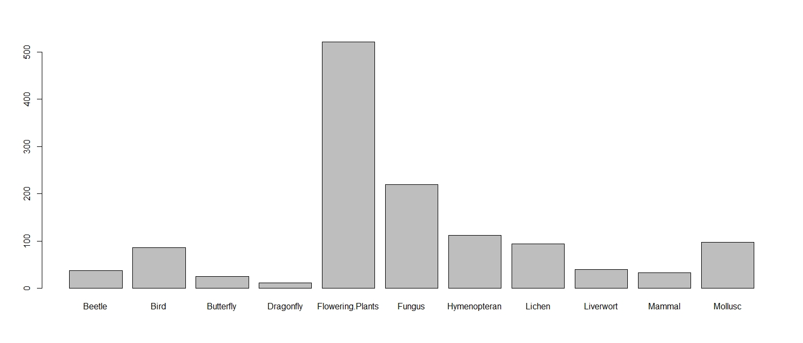
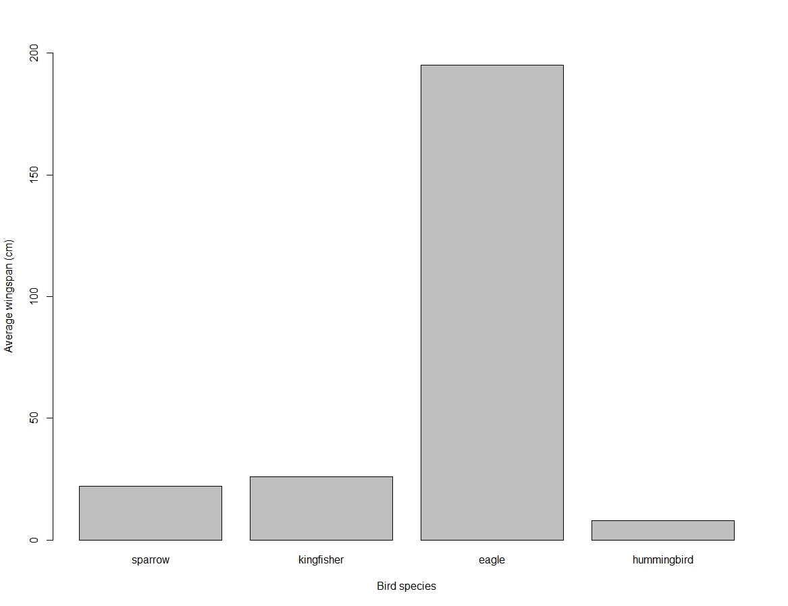

```{r setup, include=FALSE}
library(learnr)
library(gradethis)
library(palmerpenguins)
library(tidyverse)
knitr::opts_chunk$set(echo = FALSE)
tutorial_options(exercise.checker = gradethis::grade_learnr)

x <- c(55.3846, 51.5385, 46.1538, 42.8205, 40.7692, 38.7179, 35.641, 33.0769, 28.9744, 26.1538, 23.0769, 22.3077, 22.3077, 23.3333, 25.8974, 29.4872, 32.8205, 35.3846, 40.2564, 44.1026, 46.6667, 50, 53.0769, 56.6667, 59.2308, 61.2821, 61.5385, 61.7949, 57.4359, 54.8718, 52.5641, 48.2051, 49.4872, 51.0256, 45.3846, 42.8205, 38.7179, 35.1282, 32.5641, 30, 33.5897, 36.6667, 38.2051, 29.7436, 29.7436, 30, 32.0513, 35.8974, 41.0256, 44.1026, 47.1795, 49.4872, 51.5385, 53.5897, 55.1282, 56.6667, 59.2308, 62.3077, 64.8718, 67.9487, 70.5128, 71.5385, 71.5385, 69.4872, 46.9231, 48.2051, 50, 53.0769, 55.3846, 56.6667, 56.1538, 53.8462, 51.2821, 50, 47.9487, 29.7436, 29.7436, 31.2821, 57.9487, 61.7949, 64.8718, 68.4615, 70.7692, 72.0513, 73.8462, 75.1282, 76.6667, 77.6923, 79.7436, 81.7949, 83.3333, 85.1282, 86.4103, 87.9487, 89.4872, 93.3333, 95.3846, 98.2051, 56.6667, 59.2308, 60.7692, 63.0769, 64.1026, 64.359, 74.359, 71.2821, 67.9487, 65.8974, 63.0769, 61.2821, 58.7179, 55.1282, 52.3077, 49.7436, 47.4359, 44.8718, 48.7179, 51.2821, 54.1026, 56.1538, 52.0513, 48.7179, 47.1795, 46.1538, 50.5128, 53.8462, 57.4359, 60, 64.1026, 66.9231, 71.2821, 74.359, 78.2051, 67.9487, 68.4615, 68.2051, 37.6923, 39.4872, 91.2821, 50, 47.9487, 44.1026)

y <- c(97.1795, 96.0256, 94.4872, 91.4103, 88.3333, 84.8718, 79.8718, 77.5641, 74.4872, 71.4103, 66.4103, 61.7949, 57.1795, 52.9487, 51.0256, 51.0256, 51.0256, 51.4103, 51.4103, 52.9487, 54.1026, 55.2564, 55.641, 56.0256, 57.9487, 62.1795, 66.4103, 69.1026, 55.2564, 49.8718, 46.0256, 38.3333, 42.1795, 44.1026, 36.4103, 32.5641, 31.4103, 30.2564, 32.1795, 36.7949, 41.4103, 45.641, 49.1026, 36.0256, 32.1795, 29.1026, 26.7949, 25.2564, 25.2564, 25.641, 28.718, 31.4103, 34.8718, 37.5641, 40.641, 42.1795, 44.4872, 46.0256, 46.7949, 47.9487, 53.718, 60.641, 64.4872, 69.4872, 79.8718, 84.1026, 85.2564, 85.2564, 86.0256, 86.0256, 82.9487, 80.641, 78.718, 78.718, 77.5641, 59.8718, 62.1795, 62.5641, 99.4872, 99.1026, 97.5641, 94.1026, 91.0256, 86.4103, 83.3333, 79.1026, 75.2564, 71.4103, 66.7949, 60.2564, 55.2564, 51.4103, 47.5641, 46.0256, 42.5641, 39.8718, 36.7949, 33.718, 40.641, 38.3333, 33.718, 29.1026, 25.2564, 24.1026, 22.9487, 22.9487, 22.1795, 20.2564, 19.1026, 19.1026, 18.3333, 18.3333, 18.3333, 17.5641, 16.0256, 13.718, 14.8718, 14.8718, 14.8718, 14.1026, 12.5641, 11.0256, 9.8718, 6.0256, 9.4872, 10.2564, 10.2564, 10.641, 10.641, 10.641, 10.641, 10.641, 10.641, 8.718, 5.2564, 2.9487, 25.7692, 25.3846, 41.5385, 95.7692, 95, 92.6923)

workshop_dataset <- matrix(c(x,y),ncol=2)

edidiv <- read_csv("winatr01_files/figure-html/edidiv.csv")

```


# Code exercises for Group workshop 1
You may want a copy of this weeks worksheet to hand to help you. Each exercise has some code hints, try not to use this before trying to solve the problems as a group. When prompted jot down the answers you have submitted as these will be part of the quiz hosted on Blackboard. These quizzes are vital for me to track how everyone is getting on, and to indicate areas of the course that we may need to revisit. 

## Section 1 - Working with a matrix

R’s base data structures can be organised by their dimensionality (1d, 2d, or nd) and whether they’re homogeneous (all contents must be of the same type) or heterogeneous (the contents can be of different types). We have already been working with 1d structures `vectors`:

```{r logicals2, echo=FALSE}
knitr::kable(rbind(
                    c("1d","Vector", "List"),
                    c("2d", "Matrix", "Data Frame/tibble")),
              caption = 'Basic Data Structures',
              col.names = c("", "Homeogenous", "Heterogenous"),
  booktabs = TRUE
)
```

### Exercise 1

We are going to move into a new dimension (oooo!) as we consider data in a matrix. 

First copy this into your terminal and assign it as a vector we will call `x`

55.3846, 51.5385, 46.1538, 42.8205, 40.7692, 38.7179, 35.641, 33.0769, 28.9744, 26.1538, 23.0769, 22.3077, 22.3077, 23.3333, 25.8974, 29.4872, 32.8205, 35.3846, 40.2564, 44.1026, 46.6667, 50, 53.0769, 56.6667, 59.2308, 61.2821, 61.5385, 61.7949, 57.4359, 54.8718, 52.5641, 48.2051, 49.4872, 51.0256, 45.3846, 42.8205, 38.7179, 35.1282, 32.5641, 30, 33.5897, 36.6667, 38.2051, 29.7436, 29.7436, 30, 32.0513, 35.8974, 41.0256, 44.1026, 47.1795, 49.4872, 51.5385, 53.5897, 55.1282, 56.6667, 59.2308, 62.3077, 64.8718, 67.9487, 70.5128, 71.5385, 71.5385, 69.4872, 46.9231, 48.2051, 50, 53.0769, 55.3846, 56.6667, 56.1538, 53.8462, 51.2821, 50, 47.9487, 29.7436, 29.7436, 31.2821, 57.9487, 61.7949, 64.8718, 68.4615, 70.7692, 72.0513, 73.8462, 75.1282, 76.6667, 77.6923, 79.7436, 81.7949, 83.3333, 85.1282, 86.4103, 87.9487, 89.4872, 93.3333, 95.3846, 98.2051, 56.6667, 59.2308, 60.7692, 63.0769, 64.1026, 64.359, 74.359, 71.2821, 67.9487, 65.8974, 63.0769, 61.2821, 58.7179, 55.1282, 52.3077, 49.7436, 47.4359, 44.8718, 48.7179, 51.2821, 54.1026, 56.1538, 52.0513, 48.7179, 47.1795, 46.1538, 50.5128, 53.8462, 57.4359, 60, 64.1026, 66.9231, 71.2821, 74.359, 78.2051, 67.9487, 68.4615, 68.2051, 37.6923, 39.4872, 91.2821, 50, 47.9487, 44.1026


Then copy this into your terminal and assign it as vector `y`

97.1795, 96.0256, 94.4872, 91.4103, 88.3333, 84.8718, 79.8718, 77.5641, 74.4872, 71.4103, 66.4103, 61.7949, 57.1795, 52.9487, 51.0256, 51.0256, 51.0256, 51.4103, 51.4103, 52.9487, 54.1026, 55.2564, 55.641, 56.0256, 57.9487, 62.1795, 66.4103, 69.1026, 55.2564, 49.8718, 46.0256, 38.3333, 42.1795, 44.1026, 36.4103, 32.5641, 31.4103, 30.2564, 32.1795, 36.7949, 41.4103, 45.641, 49.1026, 36.0256, 32.1795, 29.1026, 26.7949, 25.2564, 25.2564, 25.641, 28.718, 31.4103, 34.8718, 37.5641, 40.641, 42.1795, 44.4872, 46.0256, 46.7949, 47.9487, 53.718, 60.641, 64.4872, 69.4872, 79.8718, 84.1026, 85.2564, 85.2564, 86.0256, 86.0256, 82.9487, 80.641, 78.718, 78.718, 77.5641, 59.8718, 62.1795, 62.5641, 99.4872, 99.1026, 97.5641, 94.1026, 91.0256, 86.4103, 83.3333, 79.1026, 75.2564, 71.4103, 66.7949, 60.2564, 55.2564, 51.4103, 47.5641, 46.0256, 42.5641, 39.8718, 36.7949, 33.718, 40.641, 38.3333, 33.718, 29.1026, 25.2564, 24.1026, 22.9487, 22.9487, 22.1795, 20.2564, 19.1026, 19.1026, 18.3333, 18.3333, 18.3333, 17.5641, 16.0256, 13.718, 14.8718, 14.8718, 14.8718, 14.1026, 12.5641, 11.0256, 9.8718, 6.0256, 9.4872, 10.2564, 10.2564, 10.641, 10.641, 10.641, 10.641, 10.641, 10.641, 8.718, 5.2564, 2.9487, 25.7692, 25.3846, 41.5385, 95.7692, 95, 92.6923

```{r vector, exercise=TRUE}

```

```{r vector-hint-1}
x <- 
```

```{r vector-hint-2}
x <- c( ,  ,  , ...)
```

```{r vector-hint-3}
x <- c( , , , ...)
y <- c( , , , ...)
x
y
```

When you have assigned elements to vectors x and y we will combine them to create a matrix called workshop_dataset, and use the function `head` to check the first 10 rows and that everything looks ok

```{r echo=TRUE}
workshop_dataset <- matrix(c(x,y),ncol=2)
head(workshop_dataset)
```

### Exercise 2
Think back to how you could pull an element from a vector by it's position, we will try this again but for a matrix this time. What value is in the 2nd column of the 37th row of our matrix?
```{r matrix, exercise=TRUE}

```

```{r matrix-hint-1}
workshop_dataset[ , ]
```

```{r matrix-hint-2}
workshop_dataset[37, ]
```

```{r matrix-solution}
workshop_dataset[37,2]
```

```{r matrix-check}
grade_code ("You rock!")
```


### Exercise 3
Alright enough dry number crunching, let's make our first plot in R. Can you use the function `plot` to make a very simple scatter plot of our matrix?
```{r plot, exercise=TRUE}

```

```{r plot-hint-1}
plot()
```


```{r plot-solution}
plot(workshop_dataset)
```


```{r plot-check}
grade_code(
  correct = "ROOOOOOAAAAAARRRRRRR",
  incorrect = "If you put plot(x,y) then you will have got the right figure, but I was expecting you to call the matrix with plot(workshop_dataset)",)
```


## Section 2 - Diversity measures

The material you need for this session has already been loaded into our workspace, you can call it by typing `edidiv`

Our `edidiv` object has occurrence records of various species collected in Edinburgh from 2000 to 2016. To explore `edi`nburgh’s bio`div`ersity, we will create a graph showing how many species were recorded in each taxonomic group. You could calculate species richness in Excel, but that has several disadvantages, especially when working with large datasets like ours - you have no record of what you clicked on, how you sorted the data and what you copied/deleted - mistakes can slip by without you noticing. In R, on the other hand, you have your script, so you can go back and check all the steps in your analysis.

Next up check that the data was imported correctly with the `head()` function

```{r head, exercise=TRUE}

```

```{r head-hint-1}
head()
```


```{r head-solution}
head(edidiv)
```

```{r head-check}
grade_code ("Nice")

```

Ok looking good, but remember we also know about data classes, and we should check that R has assigned these to each of our vectors in a sensible way. Often, analyses in R go wrong because R decides that a variable is a certain type of data that it is not. For instance, you might have four study groups that you simply called “1, 2, 3, 4”, and while you know that it should be a categorical grouping variable (i.e. a factor), R might decide that this column contains numeric (numbers) or integer (whole number) data.
We can do this with the structure `str()` function

```{r str, exercise=TRUE}

```

```{r str-solution}
str(edidiv)
```

```{r str-check}
grade_code ("Sweet")
```

**Discuss** the classes of data assigned to each of the vectors with your group. 
Do all of these assignments in this dataframe look right to you? If not, why not? Hint: think about how you might perform stats on this data later?

```{r q1}
question("If we look at taxonGroup what might be the most suitable data class to be assigned to this?",
         answer("Character", message = "It's already classified as character, which is ok, but will make data analysis difficult"),
         answer("Numeric", message = "R won't accept that, type it in and see"),
         answer("Logical", message = "This is highly illogical Captain"),
         answer("Factor", message= "That's right, now the characters will display but they have assigned values so we can do stats such as T-tests, ANOVA on these groups now", correct = TRUE),
         allow_retry = TRUE
)
```

### Calculate Species Richness

We can use R to generate a new vector `biodiv` that is a count of all the unique species names sorted by their taxonomic groups.
```{r, message=FALSE}
example <- edidiv %>% 
group_by(taxonGroup) %>%
summarise(n=n_distinct(taxonName)) 
```

```{r example, echo=FALSE}
knitr::kable(example, caption = 'Species Richness')
```

Species richness is simply the total number of different species in a given place or group. To know how many bird, plant, mammal, etc. species we have in Edinburgh, we first need to split edidiv into multiple objects, each containing rows for only one taxonomic group. We do this with the useful `filter()` function.

**Step 1**

`Beetle <- filter(edidiv, taxonGroup == "Beetle")`
The first argument of the function is the data frame, the second argument is the condition you want to filter on. Because we only want the beetles here, we say: the variable taxonGroup MUST BE EXACTLY (==) Beetle - drop everything else from the dataset. (R is case-sensitive so it's important to watch your spelling! "beetle" or "Beetles" would not have worked here.)
You need to do these steps for ALL of the taxa listed in the data. 

**Step 2**
`a <- length(unique(Beetle$taxonName))`
`b <- length(unique(Bird$taxonName))`
If you type `a` in the console, what does it return? What does it mean? It *should* represent the number of distinct beetle species in the record.

**Step 3**
Now that you have species richness for each taxon, you can combine all those values in a vector, you should call it `biodiv`.

We do this using the c() function (c stands for concatenate). We can also add labels with the names()function, so that the values are not coming out of the blue. *Hint* you should know how to do this from the worksheet, try and figure it out as a group

**Step 4**
You can now visualise species richness with the `barplot()` function.

```{r blank, exercise=TRUE}

```

```{r blank-hint-1}
biodiv <- c(a,b,c,d,e,f,g,h,i,j,k) 
```

```{r blank-hint-2}
biodiv <- c(a,b,c,d,e,f,g,h,i,j,k) 

names(biodiv) <- c("Beetle",
                   "Bird",
                   "Butterfly",
                   "Dragonfly",
                   "Flowering.Plants",
                   "Fungus",
                   "Hymenopteran",
                   "Lichen",
                   "Liverwort",
                   "Mammal",
                   "Mollusc")
```

```{r blank-hint-3}
biodiv <- c(a,b,c,d,e,f,g,h,i,j,k) 

names(biodiv) <- c("Beetle",
                   "Bird",
                   "Butterfly",
                   "Dragonfly",
                   "Flowering.Plants",
                   "Fungus",
                   "Hymenopteran",
                   "Lichen",
                   "Liverwort",
                   "Mammal",
                   "Mollusc") 
### previously we made this an object first, but we can skip that step
barplot(biodiv)
```

```{r fig1, echo = FALSE, out.width = "100%", fig.cap="This is what you want to make"}

```


## Section 3 - Bring it all together
Alright this last exercise is a little trickier, because I won't give you the final code to check. There are a few hints but you need to (as a group) make your way to the final answer

Here are (fictional) values of the wingspan (in cm) measured on four different species of birds. Can you produce a bar plot of the mean wingspan for each species?
```{r birdtable, echo=FALSE}
knitr::kable(rbind(
                    c("sparrow","22"),
                    c("kingfisher", "26"),
                    c("eagle","195"),
                   c("hummingibird", "8"),
                   c("sparrow", "24"),
                   c("eagle", "201"),
                   c("hummingibird", "9"),
                   c("sparrow", "21"),
                   c("kingfisher", "25"),
                   c("eagle", "185"),
                   c("hummingbird", "9")),
              caption = 'Basic Data Structures',
              col.names = c("bird_species", "wingspan_mm"),
  booktabs = TRUE
)
```

Calculate the mean wingspan for each bird species. The function to do that is simply: `mean()`

```{r sparrow, exercise=TRUE}

```

```{r sparrow-hint-1}
sparrow <- mean(22, 24, 21)
```

```{r sparrow-solution}
sparrow <- mean(22, 24, 21)
kingfisher <- mean(26, 23, 25)
eagle <- mean(195, 201, 185)
hummingbird <- mean(8, 9, 9)
```

Now chain them together into a  called `wingspan`

```{r wingspan, exercise=TRUE}

```

```{r wingspan-solution}
wingspan <- c(sparrow, kingfisher, eagle, hummingbird)
```

Assign names to the vector and plot it out with `barplot`

```{r wingspan_graph, exercise=TRUE}

```

```{r wingspan_graph-hint-1}
names(wingspan) <- c("sparrow", "kingfisher", "eagle", "hummingbird")

```

```{r wingspan_graph-hint-2}
barplot(wingspan, xlab="Bird species", ylab="Average wingspan (cm)")

```

```{r wingspan_graph-solution}
barplot(wingspan, xlab="Bird species", ylab="Average wingspan (cm)", ylim=c(0,200))
### as an extra I have included the function ylim() what do you think it does?
```


```{r fig2, echo = FALSE, out.width = "100%", fig.cap="This is what you want to make"}

```

