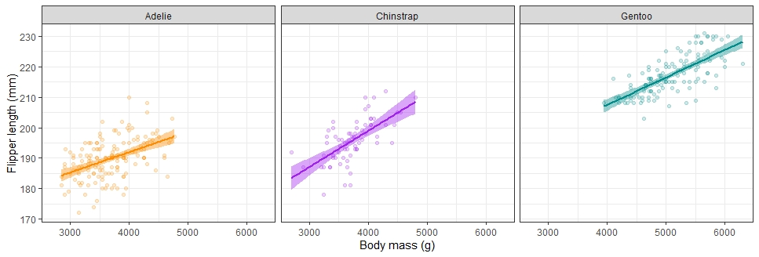

```{r setup, include=FALSE}
library(learnr)
library(gradethis)
library(tidyverse)
library(lubridate)
library(palmerpenguins)
knitr::opts_chunk$set(echo = FALSE)
tutorial_options(exercise.checker = gradethis::grade_learnr)

annual_counts <- read_csv("winatr02_files/figure-html/US.23502006.csv",
			col_type=cols(PartOfCumulativeCountSeries = col_logical())) %>%
	filter(PartOfCumulativeCountSeries) %>%
	mutate(year = year(PeriodStartDate+7)) %>%
	group_by(year) %>%
	summarize(count = max(CountValue))

```


# Data visualisation

You may want a copy of this weeks worksheet to hand to help you. 
The order of trying to figure things out, follow in this order to get the most out of the class.

- Discuss in your group
- Google!
- Use the code hints


## Section 1.1 - Geom points
### Here is the Palmer Penguins dataset  - we first saw this dataset in Week One.

```{r penguin data}
penguins
```

```{r fig1, echo = FALSE, out.width = "100%"}
knitr::include_graphics("winatr02_files/figure-html/penguins.png")
```


### Exercise 1

Create a ggplot2 graph of penguin mass on the x axis vs. flipper length on the y axis with the geom_point function. 
```{r penguin-plot, exercise=TRUE}

```

```{r penguin-plot-hint-1}
ggplot(data = penguins, aes(x =  , y =  )) + 
  geom_point()
```

```{r penguin-plot-check}
grade_code ("Good job!")

```

```{r penguin-plot-hint-2}
ggplot(data = penguins, aes(x = body_mass_g, y =  )) + 
  geom_point()
```

```{r penguin-plot-solution}
ggplot(data = penguins, aes(x = body_mass_g, y = flipper_length_mm)) + 
  geom_point()
```

## Section 1.2 - Colouring by species


### Exercise 2
We can see that there is an overall positive correlation between body mass and flipper length. Let's see how those trends look when we colour the points by species. 

Use the previous code but now add a function to separate species by colour

Remember you can put this argument globally (within ggplot so it effects all geoms) or within geom_point(). For now I would like you to put this as a global argument

```{r penguin2, exercise = TRUE}

```

```{r penguin2-hint-1}
ggplot(data = penguins, aes(x = body_mass_g, y = flipper_length_mm, colour= )) + 
  geom_point()

```


```{r penguin2-solution}
ggplot(data = penguins, aes(x = body_mass_g, y = flipper_length_mm, colour=species)) + 
  geom_point()

```

```{r penguin2-check}
grade_code ("Nice!")

```

### Exercise 3

Ok lets add trendlines to this data - one for each of the species, can you recall from your worksheet how to do this?

```{r penguin3, exercise=TRUE}

```

```{r penguin3-hint-1}
geom_smooth
```


```{r penguin3-hint-2}
geom_smooth(method=lm) ### makes a straight line

```

```{r penguin3-solution}
ggplot(data = penguins, aes(x = body_mass_g, y = flipper_length_mm, colour=species)) + 
  geom_point()+
  geom_smooth(method=lm)

###This is why we made colour by species 'global' if we had set it within geom_point(colour=species) we would have to repeat it for geom_smooth(colour=species) but we set it globally so we don't. Much neater code!

```

```{r penguin3-check}
grade_code ("Swish!")

```

### Exercise 4
Ok free play time - we managed to add colours to separate points by species, but R just assigned some boring stock colours. We don't have to settle for that  - we can specify whatever colour scheme we want! Try adding colours using this chart and the function `scale_color_manual(values=c("","",""))`

```{r fig2, echo = FALSE, out.width = "100%"}
knitr::include_graphics("winatr02_files/figure-html/colors.png")
```

```{r penguin4, exercise=TRUE}

```

```{r penguin4-hint-1}
ggplot(data = penguins, aes(x = body_mass_g, y = flipper_length_mm, colour=species)) + 
  geom_point()+
  geom_smooth(method=lm)+
  scale_color_manual()
```


```{r penguin4-hint-2}
ggplot(data = penguins, aes(x = body_mass_g, y = flipper_length_mm, colour=species)) + 
  geom_point()+
  geom_smooth()+
  scale_color_manual(values=c())
```

```{r penguin4-hint-3}
ggplot(data = penguins, aes(x = body_mass_g, y = flipper_length_mm, colour=species)) + 
  geom_point()+
  geom_smooth(method=lm)
  scale_color_manual(values=c("#00846b","#846b00","#6a0084"))
```


### Exercise 5
Make a good graph great!
Working as a group can you play with your code to try and recreate the plot below as closely as you can. 

No hints this time!

Talk to each other, use google, your worksheet notes and the ggplot [cheatsheet](https://rstudio.com/wp-content/uploads/2015/03/ggplot2-cheatsheet.pdf) to guide you. 

Things to look out for
- Axis labels
- Facet wraps
- Points and trend lines coloured by species
- no legend
- faded data points
- simple background


```{r penguin5, exercise=TRUE}

```

```{r fig3, echo = FALSE, out.width = "100%"}

```

```{r, eval=FALSE}
ggplot(data = penguins, aes(x = body_mass_g, y = flipper_length_mm, colour=species, fill=species)) + 
    geom_point(alpha=0.2)+
    geom_smooth(method=lm)+
    scale_color_manual(values=c("darkorange","purple","cyan4"))+ scale_fill_manual(values=c("darkorange","purple","cyan4"))+
    guides(color="none", fill="none")+
    xlab("Body mass (g)")+
   ylab("Flipper length (mm)")+
   facet_wrap(.~species)+
   theme_bw()
```

## Section 2.1 - second week

```{r echo=FALSE, warning=FALSE, message=FALSE}
library(tidyverse)
library(lubridate)

annual_counts <- read_csv("winatr02_files/figure-html/US.23502006.csv",
			col_type=cols(PartOfCumulativeCountSeries = col_logical())) %>%
	filter(PartOfCumulativeCountSeries) %>%
	mutate(year = year(PeriodStartDate+7)) %>%
	group_by(year) %>%
	summarize(count = max(CountValue))

```


Today we are looking at instances of Lyme Disease in the State of Michigan, USA.
[Project Tycho](https://www.tycho.pitt.edu/) is an organisation which collects long-term datastes include disease prevalence, as a mechanism for improve global health. They can monitor the effectiveness of societal changes, health programs, disease control programmes over time...

Here we have the reported annual cases of Lyme Disease in the State of Michigan, USA from 1991-2016. 

```{r}
annual_counts
```

### Exercise 1 

**Can you unjumble this code to recreate the graph below?** 

Hint: all the code is here, but some functions need to put *inside* the right brackets.

geom_line() +

ggplot() +

scale_y_continuous() +

breaks=c(1990, 1995, 2000, 2005, 2010, 2015)
	
scale_x_continuous() +
	
labs(x="Year", 
      y="Number of cases",
		    title="The number of Lyme disease cases has been rising since 1990") +
		    
theme_classic()
	
limits=c(0,NA)
	
annual_counts, aes(x=year, y=count)

```{r}


```

```{r, echo=FALSE}
ggplot(annual_counts, aes(x=year, y=count)) +
	geom_line() +
	scale_y_continuous(limits=c(0,NA)) +
	scale_x_continuous(breaks=c(1990, 1995, 2000, 2005, 2010, 2015)) +
	labs(x="Year",
		y="Number of cases",
		title="The number of Lyme disease cases has been rising since 1990") +
	theme_classic()
```

### Exercise 2

Can you get the plot to show data for 1995,2005 & 2015

```{r lyme, exercise=TRUE}

```

```{r lyme-solution}
ggplot(annual_counts, aes(x=year, y=count)) +
	geom_line() +
	scale_y_continuous(limits=c(0,NA)) +
	scale_x_continuous(breaks=c(1995, 2005, 2015)) +
	labs(x="Year",
			y="Number of cases",
			title="The number of Lyme disease cases has been rising since 1990") +
	theme_classic()
```

What happens if you change the `limits` argument for `scale_y_continuous` to `c(0,1000)`

```{r lyme2, exercise=TRUE}

```

```{r lyme2-solution}
ggplot(annual_counts, aes(x=year, y=count)) +
	geom_line() +
	scale_y_continuous(limits=c(0,10000)) +
	scale_x_continuous(breaks=c(1990, 1995, 2000, 2005, 2010, 2015)) +
	labs(x="Year",
			y="Number of cases",
			title="The number of Lyme disease cases has been rising since 1990") +
	theme_classic()
```

### Exercise 3

What if I wanted to plot each individual years number of cases as a data point, and fit a trend line? Can you modify our original graph to do this?

```{r lyme3, exercise=TRUE}

```

```{r lyme3-solution}
ggplot(annual_counts, aes(x=year, y=count)) +
	geom_point() + 
  geom_smooth(method=lm)+
	scale_y_continuous(limits=c(0,NA)) +
	scale_x_continuous(breaks=c(1990, 1995, 2000, 2005, 2010, 2015)) +
	labs(x="Year",
			y="Number of cases",
			title="The number of Lyme disease cases has been rising since 1990") +
	theme_classic()
```

```{r, echo=FALSE}
ggplot(annual_counts, aes(x=year, y=count)) +
	geom_point() + 
  geom_smooth(method=lm)+
	scale_y_continuous(limits=c(0,NA)) +
	scale_x_continuous(breaks=c(1990, 1995, 2000, 2005, 2010, 2015)) +
	labs(x="Year",
			y="Number of cases",
			title="The number of Lyme disease cases has been rising since 1990") +
	theme_classic()
```


**Bonus Question** Why do you think the standard error of the fitted linear model only starts from data point 3 onwards?

###Exercise 4

**Built in themes**
theme_classic is one of the themes that is built into ggplot2. Here are some of the others that you can use… to add to your (p)lot. Have a go and see how they modify the look of your plots

p + theme_gray() # the default
p + theme_linedraw()
p + theme_light()
p + theme_dark()
p + theme_minimal()
p + theme_classic()
p + theme_void()

```{r}

```
